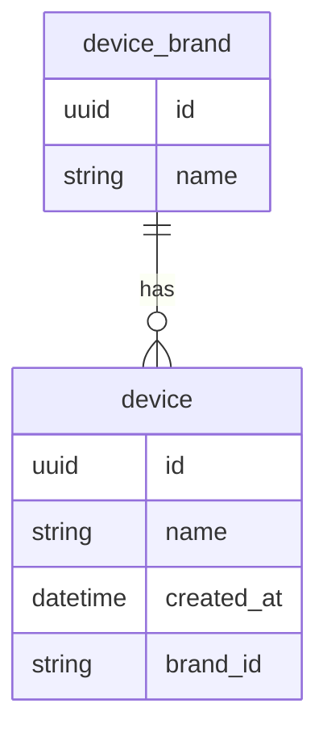

# device-app 📱

## Instructions on how to start

1. Clone the repository
2. Start a Docker server. On Mac it can be done by opening the Docker app.
3. Run this command on repository's folder `docker-compose up`

## Tech stack

1. TypeScript & Nest.js on top of Express.js.
2. PostgreSQL with TypeORM.

## Out of scope

1. Authentication
3. Logging
4. Swagger documentation


## DB Design 



## API

### 1. Create a device brand

```bash
curl -X POST http://localhost:3000/brands -H "Content-Type: application/json" -d '{"name": "Blackberry"}'
```

### 2. Create a device

```bash
curl -X POST http://localhost:3000/devices -H "Content-Type: application/json" -d '{"name": "Blackberry Phone 1", "brandId": "<id from request 1>"}'
```

### 4. Get a device by id

```bash
curl -X GET http://localhost:3000/devices/<id from request 2 >

```

### 5. Update a device

```bash
curl -X PATCH http://localhost:3000/devices/<id> -H "Content-Type: application/json" -d '{"name": "IPhone 12 Pro"}'
```

### 6. Get all devices

```bash
curl -X GET http://localhost:3000/devices
```

### 7. Query devices by brand name

```bash
curl -X GET "http://localhost:3000/devices?brandName=Blackberry&limit=10&offset=0"
```

### 8. Delete a device

```bash
curl -X DELETE http://localhost:3000/devices/<id>
```

## Additional notes

- Device creation time is added to the table automatically. (created_at)
- Tests are implemented for `src/device/device.service.ts` in `src/device/device.service.spec.ts`
- Soft delete is implemented. In order to replace a device, a new device is created and the old one is marked as deleted.
- Pagination is implemented for the devices list. All query parameters are optional.
- Appropriate indexes are added to the tables for better performance.
