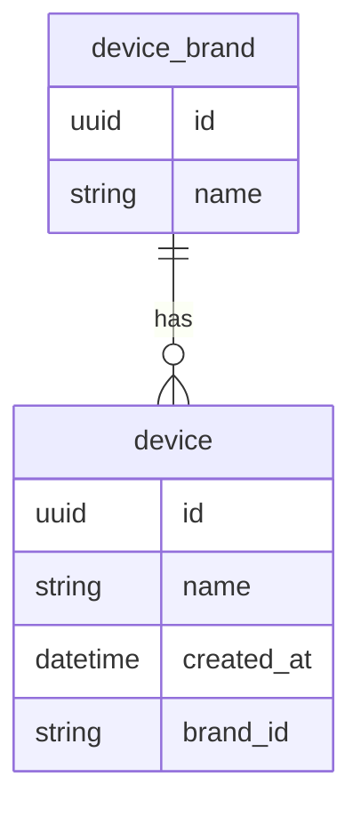

# device-app 📱

## Instructions on how to start

1. Clone the repository
2. Start a Docker server. On Mac it can be done by opening the Docker app.
3. Run this command on repository's folder `docker-compose up`

## Tech stack

1. TypeScript & Nest.js on top of Express.js.
2. PostgreSQL with TypeORM.

## Out of scope

1. Authentication
3. Logging
4. Swagger documentation


## DB Design 



## API

### 1. Create a device brand

```bash
curl -X POST http://localhost:3000/brands -H "Content-Type: application/json" -d '{"name": "Apple"}'
```

### 2. Create a device

```bash
curl -X POST http://localhost:3000/devices -H "Content-Type: application/json" -d '{"name": "iPhone 12", "brand_id": "uuid from first request"}'
```

### 3. Get all devices

```bash
curl -X GET http://localhost:3000/devices
```

