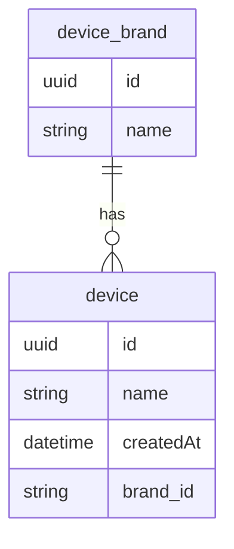

# device-app 📱

## Instructions on how to start

1. Clone the repository
2. Start a Docker server. On Mac it can be done by opening the Docker app.
3. Run this command on repository's folder `docker-compose up`

## Tech stack

1. TypeScript & Nest.js on top of Express.js.
2. PostgreSQL with TypeORM.

## Out of scope

1. Authentication
3. Logging
4. Swagger documentation

## DB Design 

